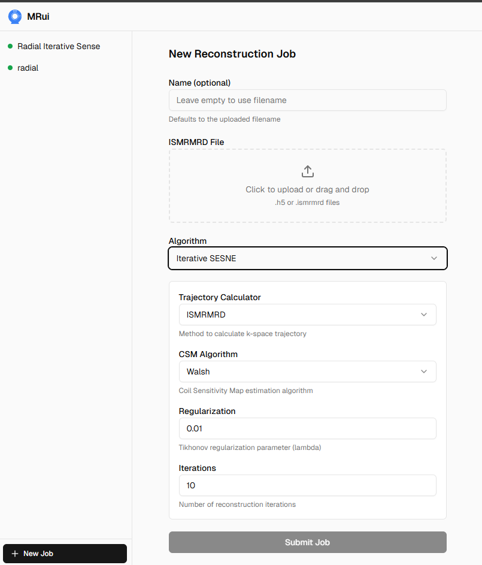
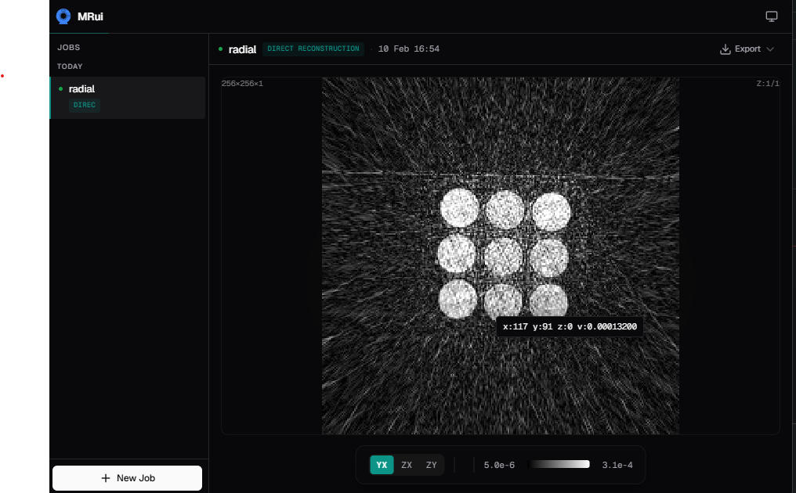

#  MRui


A web UI for running [MRpro](http://mrpro.rocks) reconstructions. Upload data, pick an algorithm, get results. Uses Huey for background jobs so you can queue up work and come back later.

## Quick start

```bash
# Everything (API + worker + frontend)
uv run dev

# Just API + worker (no frontend dev server)
uv run prod
```

Then open http://localhost:5173 (dev) or http://localhost:8000 (prod).

<table>
  <tr>
    <td></td>
    <td></td>
  </tr>
  <tr>
    <td align="center">New job</td>
    <td align="center">Result</td>
  </tr>
</table>

## How it works

You POST a file to `/api/jobs` with algorithm parameters. The backend:
1. Saves your input file
2. Creates a job record (JSON on disk)
3. Enqueues it with Huey
4. Returns a job ID

The worker picks it up, runs the reconstruction, writes an H5 file, and updates the job status. The frontend polls job status and displays results.

**Key files:**
- `mrui/main.py` - HTTP API
- `mrui/jobs.py` - Worker task that runs reconstructions
- `mrui/algorithms/` - Algorithm definitions and registry
- `mrui/storage.py` - Reading/writing job metadata

## Adding algorithms

Add your reconstruction to `mrui/algorithms/`:

1. Pick an ID in `mrui/algorithms/base.py` (`AlgorithmId` enum)
2. Create `mrui/algorithms/yours.py`:
   ```python
   class YourParams(AlgorithmParamsBase):
       algorithm: Literal[AlgorithmId.YOURS] = AlgorithmId.YOURS
       your_param: float = 0.5

   class YourAlgorithm(ReconstructionAlgorithm[YourParams]):
       id = AlgorithmId.YOURS
       name = "Your Reconstruction"
       description = "Does the thing"
       params_model = YourParams

       def run(self, task, kdata, params):
           # Reconstruct here, return IData
           ...
   ```
3. Register it in `mrui/algorithms/__init__.py`:
   ```python
   ALGORITHMS = (
       ...
       YourAlgorithm(),
   )
   ```
4. Add frontend UI in `frontend/src/components/algorithms/YoursForm.tsx` and register in `registry.ts`
5. Run `npm run typegen` in `frontend/` to update types from the backend schema

## Configuration

All env vars start with `MRUI_`:

| Variable | Default | What it does |
|----------|---------|--------------|
| `MRUI_HOST` | `0.0.0.0` | API bind address |
| `MRUI_PORT` | `8000` | API port |
| `MRUI_INPUTS_DIR` | `/tmp/mrui/inputs` | Where uploaded files go |
| `MRUI_RESULTS_DIR` | `/tmp/mrui/results` | Where results and job metadata go |
| `MRUI_QUEUE_DB_PATH` | `/tmp/mrui/queue/huey.db` | Huey SQLite database |
| `MRUI_API_WORKERS` | `1` (dev) / `2` (prod) | Uvicorn workers |

## Development

Backend:
```bash
uv run ruff check .      # Lint
uv run pyright mrui      # Type check
uv run pytest            # Run tests
```

Frontend:
```bash
cd frontend
npm run typegen          # Regenerate API types from backend
npm run lint             # ESLint
npm run build            # Production build
```
